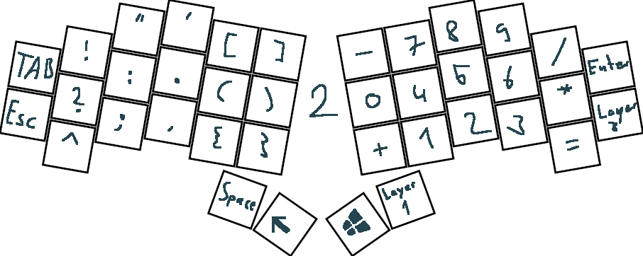

# Diese Tastatur heißt (sehr unkreativ) Rapsackey und basiert auf dem Sweep. #
Diese Tastatur war ein Versuch von mir eine kostengünstige split ortholinerar Tastatur selber zu bauen.
Beide Seiten werden durch einen Controller gesteuert und sind mit 9 einzelnen Kabeln verbunden (In Zukunft möchte ich diese aber Kabelos machen).
Die Schalter sind per Hand verkabelt/gelötet (ohne pcb) und das Gehäuse selber 3d gedruckt.

Eigenschaften:
- Shift + Backspace -> Delete (Löscht nach Rechts)
- Backspace (hold) -> CTRL + Backspace (Löscht ganze Wörter auf der linken Seite)
- Shift + Backspace (hold) -> Delete + Shift (Löscht nach Rechts die ganze Zeile)
- Layer 3 next Track Key:
    * Tap -> next Track
    * Hold (2 sec) -> Toggle Tap Hold behavior on/off
- Layer 1:
    * Tap -> Layer 1 (instant for fast typing)
    * Hold -> keeps the current Layer and behaves as Shift
- Layer 2:
    * Tap -> Layer 2 (instant for fast typing)
    * Hold -> keeps the current Layer and behaves as CTRL
- Layer 1:
    * Tap -> Layer 3 (instant for fast typing)
    * Hold -> keeps the current Layer and behaves as ALT

Ein gutes Youtube Video zum Einstieg in die Welt der Tastaturen: https://www.youtube.com/watch?v=BcXycScePHM

Zum Layout erstellen: https://ergogen.cache.works/

