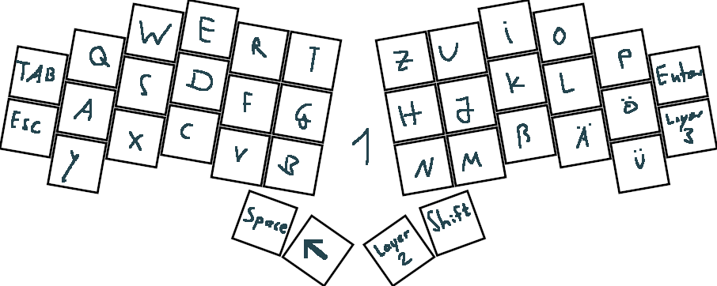

Diese Tastatur war ein Versuch von mir eine kostengünstige split ortholinerar Tastatur selber zu bauen.
Beide Seiten werden durch einen Controller gesteuert und sind mit 9 einzelnen Kabeln verbunden (In Zukunft möchte ich diese aber Kabelos machen).
Die Schalter sind per Hand verkabelt/gelötet (ohne pcb) und das Gehäuse selber 3d gedruckt.
Eine kleine Spielerei ist, dass mit Shift + Backspace --> Delete entsteht.

Ein gutes Youtube Video zum Einstieg: https://www.youtube.com/watch?v=BcXycScePHM

# Diese Tastatur heißt (sehr unkreativ) Rapsackey und basiert auf dem Sweep.

